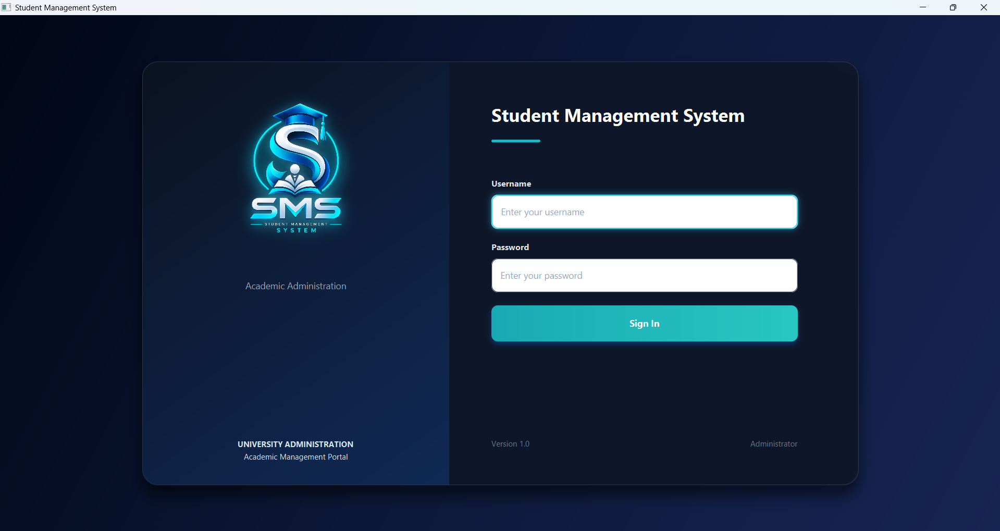
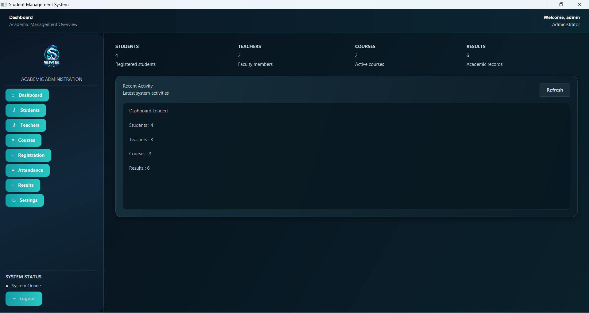
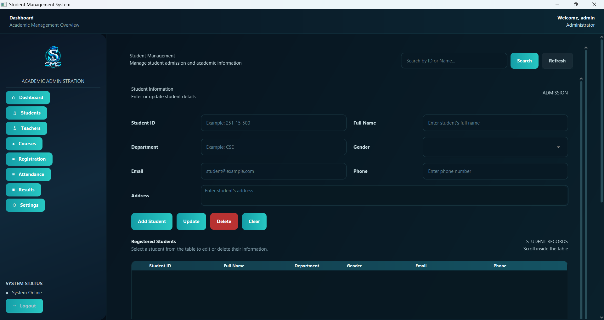
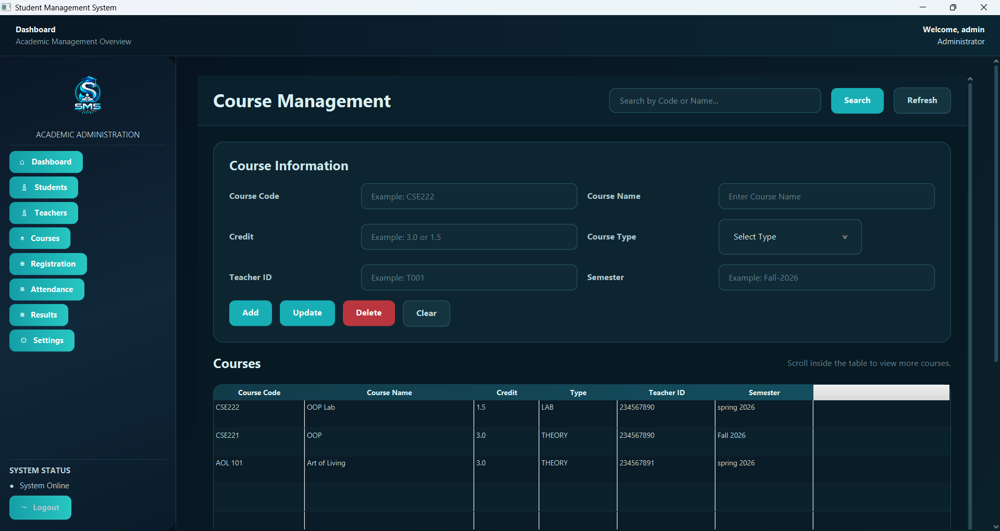
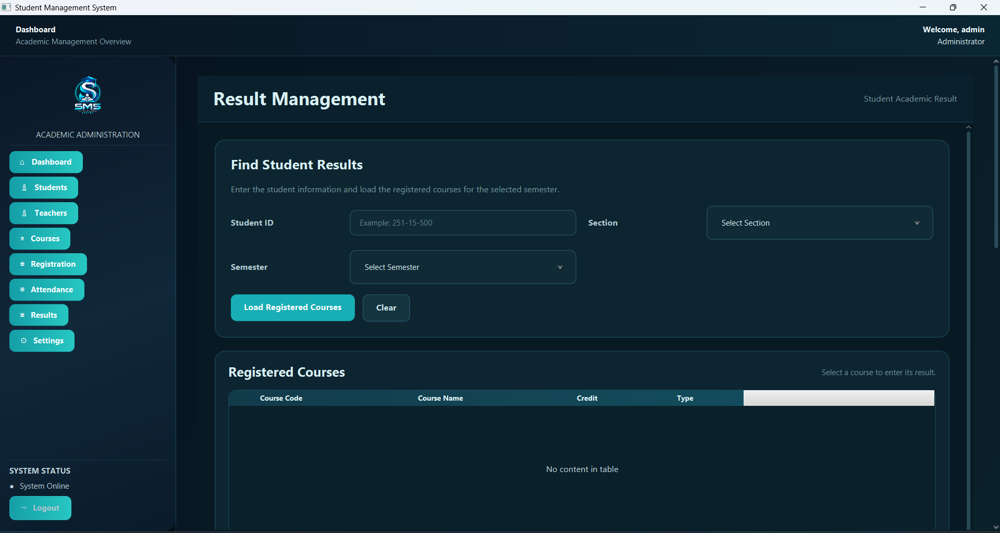
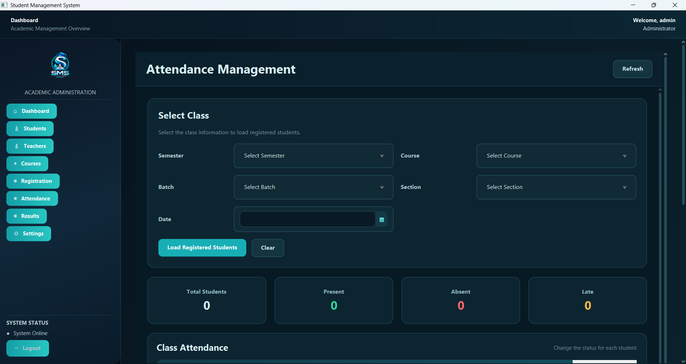

# Student Management System

A modern desktop-based **Student Management System** developed using **Java 21, JavaFX 21, Maven, FXML, CSS, and Gson**.

This project was developed as an **Object-Oriented Programming (OOP) project** to manage students, teachers, courses, registrations, attendance, academic results, and system settings through a modern JavaFX desktop application.

---

## Project Overview

The **Student Management System** is designed to simplify and organize common academic management tasks.

The system provides a user-friendly desktop interface where users can manage student information, teacher information, courses, registrations, attendance, and academic results.

The application uses **JSON files for local data persistence**, allowing the system to store and retrieve information without requiring an external database.

---

## Features

* Login and authentication
* Login loading animation
* Dashboard with academic statistics
* Student management
* Teacher management
* Course management
* Student registration
* Attendance management
* Result management
* Automatic grade calculation
* GPA calculation
* Semester GPA calculation
* Overall CGPA calculation
* Search and data management
* Settings and user information
* Logout and session management
* JSON-based local data persistence
* Modern dark-themed JavaFX interface
* Custom application logo
* Form validation
* Error handling
* Responsive JavaFX interface
* Layered project architecture

---

## Screenshots

### Login Page



### Dashboard



### Student Management



### Course Management



### Result Management



### Attendance Management



---

## Technology Stack

| Technology | Purpose                         |
| ---------- | ------------------------------- |
| Java 21    | Main programming language       |
| JavaFX 21  | Desktop GUI                     |
| Maven      | Build and dependency management |
| Gson       | JSON processing                 |
| FXML       | JavaFX UI structure             |
| CSS        | Interface styling               |
| JSON       | Local data persistence          |

---

## OOP Concepts Used

This project demonstrates important **Object-Oriented Programming concepts**:

* **Encapsulation** – Data and methods are organized inside classes with controlled access.
* **Inheritance** – Common properties and behaviors are reused through inheritance.
* **Polymorphism** – Objects can be treated according to their common parent type or interface.
* **Abstraction** – Complex implementation details are hidden behind classes and interfaces.
* **Interfaces** – Interfaces are used to define common behaviors and provide flexible implementations.
* **Exception Handling** – Errors and invalid operations are handled using Java exception handling.
* **Collections** – Java collections are used to manage groups of students, teachers, courses, and other data.
* **File Handling** – JSON files are used for storing and retrieving application data.

---

## System Architecture

The project follows a **layered architecture** to separate responsibilities and keep the code organized.

```text
                    JavaFX / FXML
                          |
                          v
                    Controllers
                          |
                          v
                      Services
                          |
                          v
                    Repositories
                          |
                          v
                    JSON Data Files
```

### Architecture Layers

#### 1. JavaFX / FXML

Responsible for the graphical user interface and application layout.

#### 2. Controllers

Handle user interactions and connect the interface with the application logic.

#### 3. Services

Contain the main business logic of the application.

#### 4. Repositories

Handle data access and communication with the JSON data files.

#### 5. JSON Data Files

Provide local data persistence for students, teachers, courses, registrations, attendance, results, and other application information.

---

## Project Structure

```text
StudentManagementSystem/
│
├── src/
│   └── main/
│       ├── java/
│       │   └── ...
│       │
│       └── resources/
│           ├── fxml/
│           ├── css/
│           ├── images/
│           └── ...
│
├── screenshots/
│   ├── login.png
│   ├── dashboard.png
│   ├── students.png
│   ├── courses.png
│   ├── results.png
│   └── attendance.png
│
├── .gitignore
├── pom.xml
└── README.md
```

---

## Requirements

Before running the project, make sure the following software is installed:

* **Java JDK 21**
* **Maven**
* **Git**
* A Java-compatible IDE such as:

  * IntelliJ IDEA
  * VS Code
  * Eclipse

---

## Installation

### 1. Clone the Repository

```bash
git clone https://github.com/samiulxr2/StudentManagementSystem.git
```

### 2. Open the Project

Navigate to the project directory:

```bash
cd StudentManagementSystem
```

Open the project using your preferred Java IDE.

---

## Running the Application

Make sure Java 21 and Maven are installed correctly.

Check Java:

```bash
java -version
```

Check Maven:

```bash
mvn -version
```

Then run:

```bash
mvn clean javafx:run
```

Maven will download the required dependencies and launch the JavaFX application.

---

## Building the Project

To clean and build the project:

```bash
mvn clean package
```

The generated build files will be placed inside the `target` directory.

---

## Data Persistence

The application uses **JSON files** for local data storage.

This approach allows the system to store information without requiring a separate database server.

Example data categories include:

```text
Students
Teachers
Courses
Registrations
Attendance
Results
Users
Settings
```

---

## Academic Result System

The system supports academic result management including:

* Marks entry
* Grade calculation
* Grade point calculation
* GPA calculation
* Semester GPA
* Overall CGPA

The system can automatically calculate academic performance based on the entered marks and course information.

---

## User Interface

The application uses **JavaFX, FXML, and CSS** to create a modern desktop interface.

The interface includes:

* Dark theme
* Custom application branding
* Dashboard cards
* Navigation sidebar
* Forms
* Tables
* Search functionality
* Validation messages
* Login interface
* Loading animation

---

## Why JavaFX?

JavaFX was used because it provides a modern framework for building Java desktop applications with:

* FXML-based UI design
* CSS styling
* Scene management
* Animation support
* Tables and forms
* Event handling
* Modern graphical components

---

## Why Maven?

Maven is used for:

* Dependency management
* Project building
* Running the JavaFX application
* Maintaining a standard Java project structure
* Simplifying project setup

---

## Why Gson?

**Gson** is used to convert Java objects into JSON and JSON data back into Java objects.

This allows the application to easily save and load information using local JSON files.

---

## GitHub Repository

**Student Management System**

https://github.com/samiulxr2/StudentManagementSystem

---

## Future Improvements

Possible future improvements include:

* MySQL/PostgreSQL database integration
* Role-based authentication
* Admin and teacher accounts
* Student profile management
* PDF report generation
* Export results to Excel
* Email notifications
* Cloud data synchronization
* Advanced analytics and reports
* Online student portal

---

## Project Purpose

This project was developed to demonstrate practical knowledge of:

* Java Programming
* Object-Oriented Programming
* JavaFX
* FXML
* CSS
* Maven
* File Handling
* JSON Data Processing
* Software Architecture
* GUI Application Development

It also demonstrates how OOP principles can be applied to develop a complete real-world desktop application.

---

## Developer

**Samiul Islam**

GitHub:
https://github.com/samiulxr2

---

## License

This project was developed for **educational and academic purposes**.
